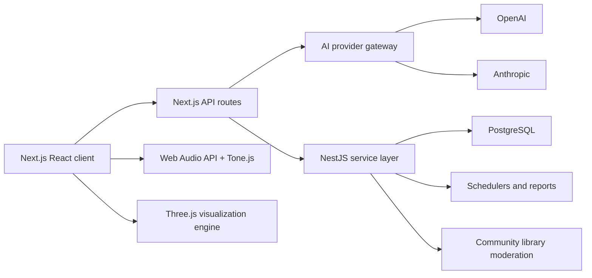

# Resonance Lab Architecture

Resonance Lab is a premium SaaS-style frequency, meditation, visualization, and self-observation platform. It is explicitly educational and reflective: it does not diagnose, treat, cure, or replace professional medical care.

## Product Principles

- Separate scientific research, hypotheses, historical spiritual teachings, and user experiences.
- Keep all sound experiments low-volume, opt-in, and browser-controlled.
- Treat personal analytics as subjective self-observation, not proof of causation.
- Make every missing provider or integration visible as demo/fallback mode.
- Keep AI responses inside the evidence-label framework.

## Current Implementation

- `src/app/page.tsx` renders the Resonance Lab application shell.
- `src/components/resonance-lab-app.tsx` owns the primary client UI, local state, journal persistence, language switching, and assistant workflow.
- `src/hooks/use-audio-lab.ts` runs the browser Web Audio engine, generated ambient soundscapes, and Tone.js bridge when available.
- `src/components/analyzer-canvas.tsx` renders real-time waveform and spectrum canvases from an `AnalyserNode`.
- `src/components/frequency-field.tsx` renders the Three.js particle and geometry visualization field.
- `src/app/api/assistant/route.ts` provides a 10-second-safe AI assistant endpoint with a local guardrail fallback.
- `src/app/api/research/route.ts` exposes evidence-labeled research-library data.
- `apps/api` contains the NestJS backend scaffold for production service ownership.

## Production Target

## Frontend

- Next.js App Router with TypeScript.
- Tailwind CSS for the interface layer.
- Framer Motion for restrained interface motion.
- Lucide icons for controls.
- Local browser persistence for demo mode.
- Future authenticated mode should move journal entries, presets, community submissions, habits, and scheduler data into PostgreSQL.
- Local-mode scheduler, habit check-ins, community protocol browsing, and AI journey prompts are implemented in the client until auth and persistence are connected.

## Audio DSP

- Pure tone engine: one or more oscillators from 1 Hz to 20,000 Hz.
- Frequency library: grouped dropdown applies Solfeggio-style carriers, Schumann values, ten beat-building offsets, and Bentov-inspired experiment values.
- Binaural engine: left/right sine oscillators around a carrier frequency.
- Isochronic engine: carrier oscillator with pulse-rate amplitude modulation.
- Ambient soundscapes: generated white, pink, brown, and rain-style noise buffers.
- Relax background music: a generated harmonic pad starts with the audio session and remains low-volume by default.
- Analyzer: `AnalyserNode` drives waveform and spectrum canvases.
- Safety: user gesture required by browsers; low default volumes; no health outcome promises.

## Visualization

- Three.js renders a particle field plus geometry rings.
- Canvas analyzers show audio waveform and spectrum.
- Breathing circle supports session pacing.
- Session timer starts and stops alongside the audio experiment.
- Visuals are attentional anchors only and should not be described as measurements of brain activity.

## Biofeedback

The current app includes a simulator fallback for heart rate, HRV, coherence, and breath synchrony. Production hardware integration should store raw samples, source metadata, and timestamps in `biofeedback_samples`. The UI must keep simulated and real hardware states visibly distinct.

## AI Assistant

The assistant should answer in four labeled sections:

- Research-supported
- Hypothesis
- Historical spiritual teaching
- User experience

Provider gateway plan:

- Use OpenAI and Anthropic behind a single server-side abstraction.
- Keep provider keys in environment variables only.
- Enforce response schema and safety language server-side.
- Refuse medical or disease-treatment claims.
- Keep Vercel/Netlify serverless functions under 10 seconds.

## Backend

The requested production backend is NestJS with PostgreSQL. This repository now includes a minimal `apps/api` NestJS service with the Fastify adapter plus health, research, assistant, and journal endpoints. A full production build should expand it with:

- Auth module.
- Experiment module.
- Journal module.
- Preset/session module.
- Scheduler module.
- Analytics module.
- Assistant gateway module.
- Research library module.
- Community moderation module.

## Data Model

See `database/schema.sql` for the proposed PostgreSQL schema. Core entities:

- users
- frequency_presets
- session_protocols
- frequency_layers
- journal_entries
- experiment_events
- biofeedback_samples
- habit_checkins
- scheduled_sessions
- assistant_threads
- assistant_messages
- research_sources
- community_protocols

## Deployment

The app is deployable as a Next.js site on Netlify or Vercel. Environment variables:

- `OPENAI_API_KEY` optional for provider-backed assistant.
- `ANTHROPIC_API_KEY` optional for provider-backed assistant.
- `DATABASE_URL` required for production NestJS/Postgres persistence.
- `NEXT_PUBLIC_APP_URL` set to the deployed app URL.

Demo mode works without secrets and uses browser-local persistence.

## Safety Review Checklist

- No page claims that frequencies cure, heal, treat, diagnose, or prevent disease.
- Solfeggio and spiritual materials are labeled as tradition or user experience.
- Bentov-inspired oscillator language is labeled as hypothesis or metaphor.
- Journal and analytics copy says subjective/self-reported.
- Assistant output always separates evidence categories.
- Exported session JSON includes the safety disclaimer.
